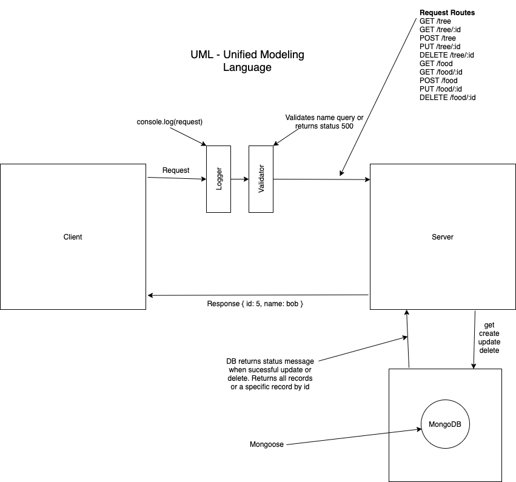

# LAB - Class 04

## Project: API Server

### Author: Simon Panek

#### Collaborators and Contributors: Tina Myers, Stacy Burris, Mariko Alvarado, Nathan Cox, Ricardo Barcenas, Brai

### Links and Resources

- [GitHub Actions](https://github.com/simon-panek/api-server/actions) 
- [Heroku Deployment](https://simonpanek-api-server.herokuapp.com/)

### Setup

#### `.env` requirements (where applicable)

- `PORT` - 3000
- `MONGOOSEDB_URI` - mongodb://localhost:27017/lab04db

#### How to initialize/run your application (where applicable)

- `npm start`

- Routes
  - `GET /tree` returns an array of all of the tree objects in the database
  - `GET /tree/:id` returns `{ name: Cedar, id: 2 }`
  - `POST /tree` adds a new tree to the database
  - `PUT /tree/:id` updates a tree object
  - `DELETE /tree/:id` deletes a specified record
  - `GET /food` returns an array of all of the food objects in the database
  - `GET /food/:id` returns `{ name: Apple, id: 2, calories: 50, type: fruit }`
  - `POST /food` adds a new food to the database
  - `PUT /food/:id` updates a food object
  - `DELETE /food/:id` deletes a specified record

#### Tests

- Unit Tests: `npm test`

#### UML

